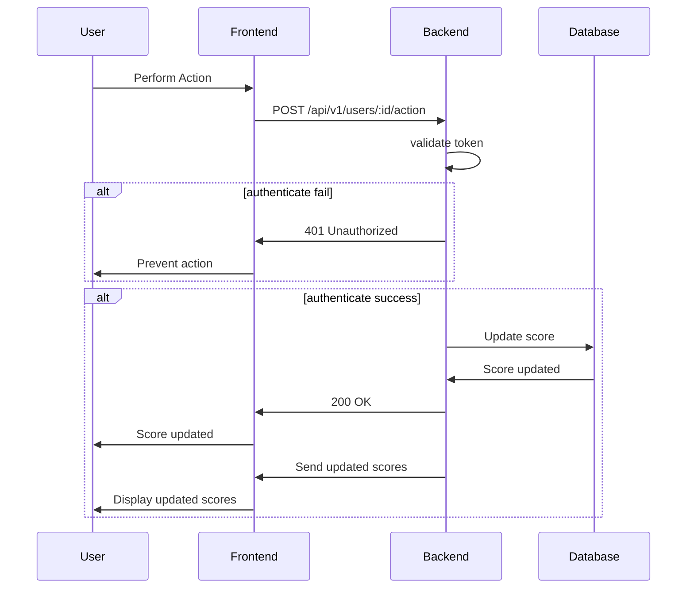

# Score Board API Module

## Overview

This module provides the backend functionality for a live-updating score board on our website. It includes endpoints for updating user scores, retrieving the top 10 scores, and ensures security measures to prevent unauthorized score increases.

### Table of Contents
-   [Features](#features)
-   [API Endpoints](#api-endpoints)
-   [Database Schema](#database-schema)
-   [Execution Flow Diagram](#execution-flow-diagram)
-   [Future Improvements](#future-improvements)
### Features
-   **Live Update**: Provides real-time updates to the score board.
-   **Top 10 Scores**: Retrieves the top 10 user scores.
-   **Score Update**: Updates user scores securely upon completion of an action.
### API Endpoints
### 1. Get Top 10 Scores
-   **Endpoint**: `/api/v1/scores/top10`
-   **Method**: `GET`
-   **Response**:
```
{ 
	"top_scores": [ 
		{"user_id": 1, "score": 100},
		{"user_id": 7, "score": 68},
		 ... 
	] 
}
```

### 2. Perform Action
-   **Endpoint**: `/api/v1/users/:id/action`
-   **Method**: `POST`
-   **Request Body**:
```
{ 
	"is_complete": true,
	"score": 10
}
```
-   **Request Header**:
```
{ 
	"Authorization": "***user_token***",
}
```
**Response**:

-   **200 OK**: Score updated successfully.
-   **400 Bad Request**: Invalid request data.
-   **401 Unauthorized**: Authentication failed.
-   **500 Internal Server Error**: Server error.


### Database Schema
```
dbdiagram.io
Table users {
	id integer [primary key]
	username varchar
	created_at timestamp
}

Table user_score {
	id integer [primary key]
	user_id integer
	score integer
	created_at timestamp
	updated_at timestamp
}
Ref: user_score.user_id - users.id
```

### Execution Flow Diagram

### Future Improvements
- **Caching**: Implement caching for frequently accessed data.
- **Cache mechanism**: Can use write-through mechanism for quick caculate top score.
- **Message Queue**: Can use the queue (RabbitMQ, SQS Queue,...) to handle a huge result updated scores send to Frontend for update in real-time
- **Continuous Integration/Continuous Deployment (CI/CD)**: Set up a CI/CD pipeline for automated testing and deployment.
- **Audit Trail**: Implement audit trail service to detect and record user actions.